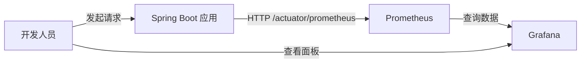

# Spring Boot 应用监控集成指南

本文档旨在指导开发人员如何在本地开发环境中，将 Spring Boot 应用接入 **Prometheus + Grafana** 监控体系。该方案采用企业级标准的 **Micrometer** 指标采集方式，替代传统的 AOP 日志记录性能指标，实现无侵入、高性能的监控。

## 1. 监控架构



- **数据采集**: Spring Boot Actuator + Micrometer
- **数据存储**: Prometheus (本地 Docker)
- **数据展示**: Grafana (本地 Docker)
- **网络模型**: 容器 (Prometheus) 访问 宿主机 (Spring Boot)

## 2. Spring Boot 应用配置

### 2.1 引入依赖
在 `pom.xml` 中引入 Actuator 和 Prometheus 注册表：

```xml
<dependencies>
    <!-- 监控核心 -->
    <dependency>
        <groupId>org.springframework.boot</groupId>
        <artifactId>spring-boot-starter-actuator</artifactId>
    </dependency>
    <!-- Prometheus 指标转换 -->
    <dependency>
        <groupId>io.micrometer</groupId>
        <artifactId>micrometer-registry-prometheus</artifactId>
    </dependency>
</dependencies>
```

### 2.2 配置文件 (application.yml)
**关键点**：必须开启 `percentiles-histogram`，否则无法计算 P95/P99 延迟。

```yaml
server:
  port: 8080

management:
  endpoints:
    web:
      exposure:
        include: "health,info,prometheus" # 仅暴露必要端点
  endpoint:
    prometheus:
      enabled: true
  metrics:
    tags:
      application: ${spring.application.name:local-app} # 应用标识
    distribution:
      percentiles-histogram:
        http:
          server:
            requests: true # 【重要】开启直方图以支持 P95/P99 计算
      slo: # (可选) 自定义桶分布，更精确匹配业务耗时
        http:
          server:
            requests: 10ms, 50ms, 100ms, 200ms, 500ms, 1s, 5s, 10s
```

### 2.3 测试接口 (可选)
为了验证监控效果，建议提供一个可控制延迟的接口：

```java
@RestController
@RequestMapping("/api/test")
public class MonitorTestController {
    @GetMapping("/search")
    public String search(@RequestParam(required = false) Long delay) throws InterruptedException {
        if (delay != null) Thread.sleep(delay);
        return "OK";
    }
}
```

## 3. 基础设施配置 (Docker)

本项目根目录已包含监控栈配置。

### 3.1 目录结构说明
```text
.
├── data                # 持久化数据目录
│   ├── grafana
│   └── prometheus
├── docker-compose.yml  # 编排文件
├── prometheus
│   └── prometheus.yml  # Prometheus 配置
└── grafana
    └── provisioning    # Grafana 自动配置 (数据源/面板)
```

### 3.2 Prometheus 配置 (prometheus/prometheus.yml)
确保 `targets` 指向宿主机。

```yaml
scrape_configs:
  - job_name: 'spring-boot-app'
    metrics_path: '/actuator/prometheus'
    static_configs:
      # Windows/Mac: host.docker.internal
      # Linux: 需配合 docker-compose extra_hosts 或使用宿主机 IP
      - targets: ['host.docker.internal:8080'] 
        labels:
          env: 'local-dev'
```

### 3.3 Docker Compose 配置 (docker-compose.yml)
**注意**：为了兼容 Linux 环境，已添加 `extra_hosts` 配置。

```yaml
version: '3'
services:
  prometheus:
    image: prom/prometheus:latest
    ports:
      - "9090:9090"
    volumes:
      - ./prometheus/prometheus.yml:/etc/prometheus/prometheus.yml
      - ./data/prometheus:/prometheus
    command:
      - '--config.file=/etc/prometheus/prometheus.yml'
    extra_hosts:
      - "host.docker.internal:host-gateway" # 兼容 Linux 的关键配置
    networks:
      - monitor-net

  grafana:
    image: grafana/grafana:latest
    ports:
      - "3000:3000"
    environment:
      - GF_SECURITY_ADMIN_USER=admin
      - GF_SECURITY_ADMIN_PASSWORD=admin
    volumes:
      - ./data/grafana:/var/lib/grafana
      - ./grafana/provisioning:/etc/grafana/provisioning # 自动加载数据源
    depends_on:
      - prometheus
    networks:
      - monitor-net

networks:
  monitor-net:
    driver: bridge
```

### 3.4 启动监控栈
```bash
docker-compose up -d
```

## 4. 验证与使用

### 4.1 验证数据采集
1.  启动 Spring Boot 应用。
2.  访问 `http://localhost:8080/actuator/prometheus`，确认能看到 `http_server_requests_seconds_count` 等指标。
3.  访问 `http://localhost:9090/targets`，确认 `spring-boot-app` 状态为 **UP**。

### 4.2 配置 Grafana 面板
如果 `grafana/provisioning` 未配置自动数据源，请手动添加：
1.  登录 Grafana (`admin/admin`)。
2.  **Add Data Source** -> **Prometheus**。
3.  **URL**: `http://prometheus:9090` (注意是容器名，不是 localhost)。
4.  保存并测试。

### 4.3 查询 P95/P99 延迟
在 Grafana 中新建 Panel，使用以下 PromQL：

**P95 延迟:**
```promql
histogram_quantile(0.95, sum(rate(http_server_requests_seconds_bucket{uri="/api/test/search"}[5m])) by (le))
```

**P99 延迟:**
```promql
histogram_quantile(0.99, sum(rate(http_server_requests_seconds_bucket{uri="/api/test/search"}[5m])) by (le))
```

你说得非常对。在监控文档中，**“纵轴代表什么”**以及**“如何解读图表”**是核心内容，如果解释不清楚，开发人员很容易误判系统状态。

以下是补充完善后的 **Grafana 面板配置与解读指南**，你可以直接替换或追加到 `README-springboot.md` 的第 4.3 节中。

---

## 4.3 配置 Grafana 面板 (详细版)

### 4.1. 面板基础设置 (Panel Settings)

在 Grafana 新建 Panel 时，除了填写 PromQL，必须正确配置可视化选项，否则图表无法阅读。

| 配置项 | 推荐设置 | 说明 |
| :--- | :--- | :--- |
| **Visualization** | `Time series` | 时间序列折线图 |
| **Unit (单位)** | `Seconds` 或 `Milliseconds` | **关键**：Prometheus 返回的是秒 (s)，若选 Milliseconds 会自动 *1000 显示 |
| **Min** | `0` | 强制纵轴从 0 开始，避免视觉夸大波动 |
| **Legend (图例)** | `{{quantile}}` 或自定义 | 显示 P95/P99 标签 |

### 4.2 纵轴含义深度解读

#### 4.2.1 单位与数值

*   **原始数据**：Micrometer 记录的指标单位是 **秒 (seconds)**。
*   **纵轴显示**：
    *   若 Grafana Unit 设为 `Seconds`：纵轴显示 `0.05`, `0.1`, `1.5` 等。
    *   若 Grafana Unit 设为 `Milliseconds`：纵轴显示 `50`, `100`, `1500` 等。
    *   **建议**：为了直观，推荐设置为 `Milliseconds` (ms)。

#### 4.2.2 P95 与 P99 的业务含义

不要只看平均值（Average），平均值会掩盖长尾问题。

| 指标 | 含义 | 业务解读 | 示例 |
| :--- | :--- | :--- | :--- |
| **P95** | 95% 的请求低于该值 | **大多数用户的体验**。如果 P95 正常，说明 95% 的用户感觉系统流畅。 | P95=200ms：100 个请求中，95 个在 200ms 内完成。 |
| **P99** | 99% 的请求低于该值 | **极端情况/长尾延迟**。反映系统最慢的那 1% 请求，通常是 GC、锁竞争、慢 SQL 导致的。 | P99=2s：100 个请求中，有 1 个慢到 2 秒，这 1 个请求可能导致前端超时。 |
| **P99 - P95** | 差值 | **系统稳定性**。差值越大，说明系统波动越剧烈，存在偶发卡顿。 | P95=100ms, P99=2000ms：系统存在严重的长尾问题。 |

#### 4.2.3 图表形态解读

```text
纵轴 (耗时 ms)
  ^
  |                  /--\  <-- 尖峰：偶发抖动 (GC/网络)
  |                 /    \
  |     _________--/      \--_________  <-- P99 线 (敏感，波动大)
  |    /                          \
  |___/____________________________\___  <-- P95 线 (相对平稳)
  |
  +------------------------------------> 横轴 (时间)
```

*   **平稳直线**：系统负载稳定，无资源竞争。
*   **阶梯状上升**：可能存在内存泄漏或连接池耗尽，性能随时间衰退。
*   **P99 远高于 P95**：典型的**长尾延迟**，需排查慢 SQL、Full GC 或外部依赖超时。
*   **P95/P99 同时飙升**：系统整体过载，需考虑扩容或限流。

### 4.3. 推荐阈值 (SLA 参考)

不同业务对延迟的容忍度不同，以下是通用 Web 应用的参考标准：

| 接口类型 | P95 阈值 | P99 阈值 | 告警级别 |
| :--- | :--- | :--- | :--- |
| **核心 API** (登录/支付) | < 200ms | < 500ms | P0 (电话报警) |
| **一般查询** (列表/详情) | < 500ms | < 1000ms | P1 (短信/钉钉) |
| **复杂报表** (导出/统计) | < 5s | < 10s | P2 (邮件) |

> **注意**：如果你的接口包含人工操作或第三方调用，阈值需相应放宽。

### 4.4. 完整 PromQL 示例 (带单位转换)

以下查询直接返回 **毫秒 (ms)** 单位，方便 Grafana 纵轴显示：

```promql
# P95 延迟 (毫秒)
histogram_quantile(0.95,
  sum(rate(http_server_requests_seconds_bucket{uri="/api/test/search"}[5m])) by (le)
) * 1000

# P99 延迟 (毫秒)
histogram_quantile(0.99,
  sum(rate(http_server_requests_seconds_bucket{uri="/api/test/search"}[5m])) by (le)
) * 1000
```

### 4.5. 常见误读与避坑

| 误读现象 | 真实原因 | 解决方案 |
| :--- | :--- | :--- |
| **曲线为 0 或空** | 没有流量 或 时间窗口过大 | 1. 先访问接口产生流量<br>2. 将 `[5m]` 改为 `[1m]` 观察实时数据 |
| **P99 比 P95 低** | 数据采样不足 或 计算误差 | 在低流量下（如 < 10 QPS），分位数计算可能不准，增加流量再观察 |
| **纵轴数值极大** | 单位搞错 (秒当毫秒看) | 检查 Grafana Unit 设置，确认是否已 *1000 |
| **曲线锯齿严重** | 抓取间隔太短 或 流量太小 | 增加 `rate()` 的时间窗口，如从 `[1m]` 改为 `[5m]` 平滑曲线 |

---

### 6. 补充：如何添加平均值参考线

为了更全面地评估，建议在同一面板中添加 **Average (平均耗时)** 作为参考：

```promql
# 平均耗时 (毫秒)
sum(rate(http_server_requests_seconds_sum{uri="/api/test/search"}[5m]))
/
sum(rate(http_server_requests_seconds_count{uri="/api/test/search"}[5m]))
* 1000
```

**解读**：
*   如果 **Average ≈ P95**：系统非常稳定，耗时分布均匀。
*   如果 **Average << P95**：存在少量极慢请求拉高了 P95，但大部分请求很快（典型长尾）。


### 4.4 压测验证
使用 JMeter 或 `ab` 工具对接口发起请求，观察 Grafana 曲线变化。
- **正常请求**: 曲线平稳。
- **模拟慢查询**: 请求 `?delay=2000`，观察 P99 曲线是否飙升。

## 5. 常见问题 (Troubleshooting)

| 问题现象 | 可能原因 | 解决方案 |
| :--- | :--- | :--- |
| **Prometheus Targets DOWN** | 网络不通 | 1. 检查 Spring Boot 是否启动<br>2. 检查防火墙是否拦截 8080<br>3. Linux 用户确认 `extra_hosts` 已配置 |
| **Grafana 无数据** | 指标未产生 | 1. 先访问几次接口产生流量<br>2. 确认 `percentiles-histogram` 已开启<br>3. 检查 PromQL 中的 `uri` 是否与实际一致 |
| **P99 计算不准** | 桶分布默认 | 在 `application.yml` 中配置 `management.metrics.distribution.slo` 自定义桶 |
| **基数爆炸 (Cardinality)** | 标签包含 ID | **禁止**将用户 ID、订单 ID 等高风险标签放入 Metrics，仅使用 `uri`, `method`, `status` |

## 6. 生产环境差异说明 (重要)

**本地配置不可直接用于生产**，主要区别如下：

1.  **服务发现**: 生产环境使用 K8s SD 或 Consul SD，而非 `static_configs` 静态配置。
2.  **网络安全**: 
    - 生产环境 Actuator 端口应监听内网网卡 (`management.server.address`)。
    - 需配置 Security 认证或网络白名单，仅允许 Prometheus 服务器访问。
3.  **高可用**: 生产环境 Prometheus 需集群部署 (Thanos/VictoriaMetrics)，本地仅为单点。
4.  **标签管理**: 生产环境需通过 CI/CD 注入 `version`, `commit_id`, `env` 等标签。

## 7. 参考文档
- [Micrometer Documentation](https://micrometer.io/)
- [Spring Boot Actuator](https://docs.spring.io/spring-boot/docs/current/reference/html/actuator.html)
- [Prometheus Best Practices](https://prometheus.io/docs/practices/)

